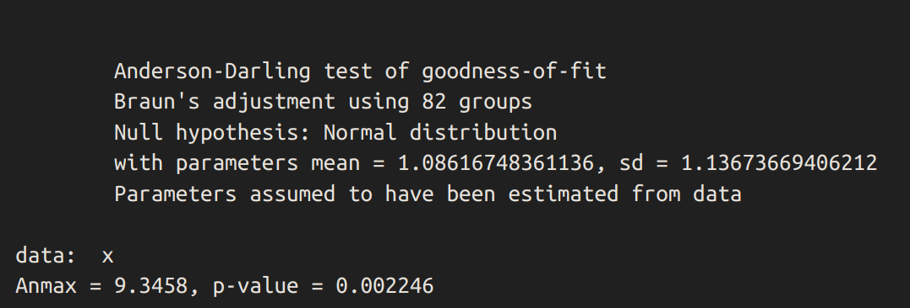
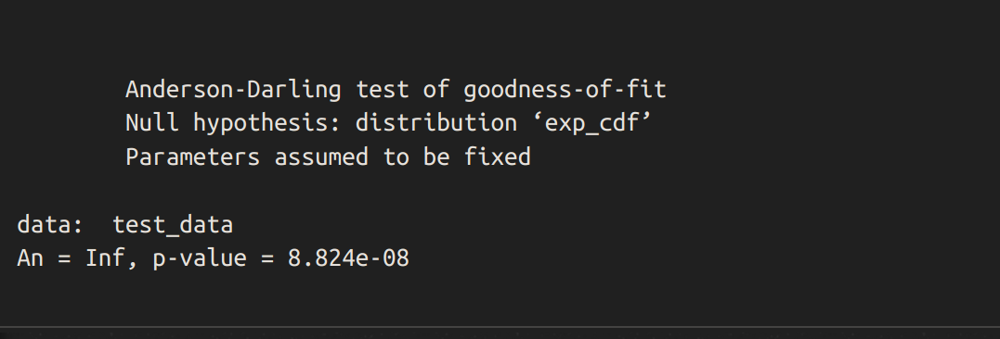
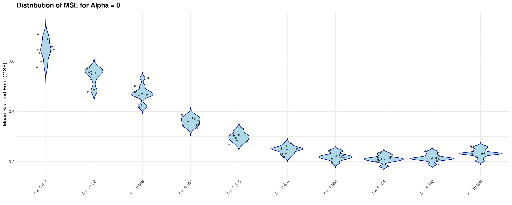
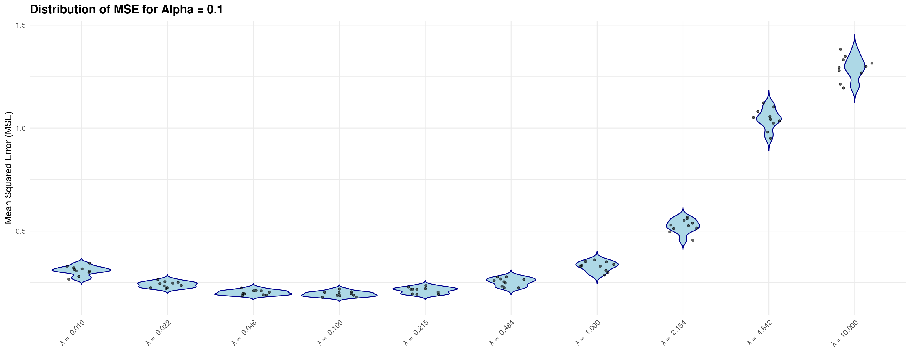
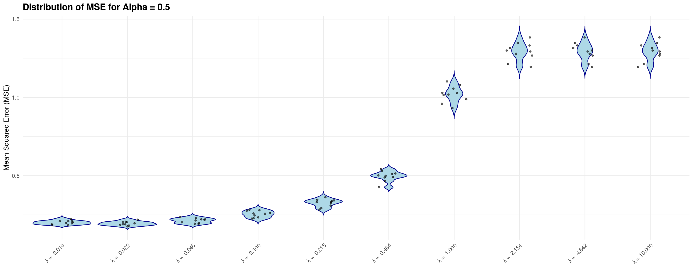
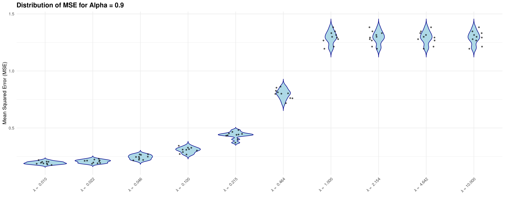
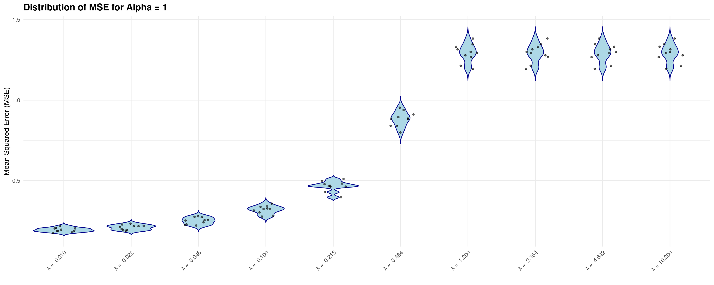

```{r setup, include=FALSE}
library(knitr)
knitr::opts_chunk$set(echo = TRUE)
knitr::opts_chunk$set(cache = TRUE)
knitr::opts_chunk$set(eval = FALSE)


library(ggplot2)
library(reshape2)
library(caret)
library(dplyr)
library(glmnet)
library(ranger)
library(goftest)

library(foreach)
library(doParallel)
```

# 1. Eksploracja danych

```{r wczytywanie danych, eval=TRUE}
X_test <- read.csv("X_test.csv")
X_train <- read.csv("X_train.csv")
Y_train <- read.csv("y_train.csv")
```

## $a)$ Rozmiar danych i typ zmiennych

Widzimy, że dane treningowe składają się z $6800$ obserwacji i $9000$ zmiennych objaśniających. Dane testowe składają się z $1200$ obserwacji i $9000$ zmiennych objaśniających. Zmienna objaśniana (białko $CD36$) jest jednowymiarowa. Wszystkie zmienne są typu 'double', co jest zgodne z oczekiwaniami. Tym samym nie dokonujemy konwersji typów zmiennych. Nie ma braków danych.

```{r podstawowa eksploracja danych, eval=TRUE}
print("Dane treningowe - RNA")
print(dim(X_train))

print("Dane treningowe - białko powierzchniowe")
print(dim(Y_train))

print("Dane testowe - RNA")
print(dim(X_test))
```

```{r typ zmiennych i braki danych, eval=TRUE}
# Typ zmiennych - wszystkie powinny być typu 'double'
print("Czy wszystkie zmienne są typu double:")
print(all(sapply(X_test, is.double)))
print(all(sapply(X_train, is.double)))
print(all(sapply(Y_train, is.double)))

print("Czy są braki danych:")
# Sprawdzenie czy są braki danych
print(any(sapply(X_test, is.na)))
print(any(sapply(X_train, is.na)))
print(any(sapply(Y_train, is.na)))
```

## $b)$ Rozkład zmiennej objaśnianej

Zmienna objaśniana (białko $CD36$) jest zmienną ciągłą. Na histogramie widać, że dla wartości mniejszych od $0.5$ występuje duża liczba obserwacji. Wykres kwantylowy pokazuje, że rozkład zmiennej objaśnianej jest zbliżony do rozkładu normalnego, z wyjątkiem wartości skrajnie małych.

```{r podpunkt b - rozkład zmiennej objaśnianej, eval=TRUE}
# Badamy rozkład zmiennej objaśnianej (dane 'Y_train')
summary(Y_train)

# Histogram
ggplot(data = Y_train, aes(x = CD36)) + geom_histogram(color="black", fill="white")

# Wykres kwantylowy
ggplot(data = Y_train) + geom_qq(aes(sample = CD36), size=1.5, color="red")
```

## $c)$ Korelacja zmiennych

Obrazujemy korelację zmiennych na mapie ciepła. Wybieramy $250$ zmiennych o największej korelacji z zmienną objaśnianą. Widać, że niektóre zmienne są ze sobą mocno skorelowane.

```{r podpunkt c - korelacja zmiennych, eval=TRUE}
# Korelacja zmiennych
# Wybieramy 250 zmiennych o największej korelacji z zmienną objaśnianą
correlated <- apply(X_train, 2, function (x) cor(x, Y_train))
X_high_cor <- X_train[, order(correlated, decreasing = T)[1:250]]

# Macierz korelacji
cor_matrix <- cor(X_high_cor)
cor_relations <- melt(cor_matrix)

# Ilustrujemy wynik za pomocą mapy ciepła
library(viridis)
Var.heatmap <- ggplot(data = cor_relations, mapping = aes(x = Var1,
                                                          y = Var2,
                                                          fill = value)) +
  geom_tile() + scale_fill_viridis(discrete=FALSE) +
  theme(axis.text.x = element_blank(), axis.text.y = element_blank()) +
  coord_fixed()

print(Var.heatmap)
```

# 2. Testy statystyczne


## $a)$ Wykres kwantylowy

Najpierw rysujemy wykres kwantylowy porównujący zmienną objaśnianą z rozkładem normalnym.

```{r wykres kwantylowy, eval=TRUE}
qq_plot <- ggplot(data = Y_train, aes(sample = CD36)) +
  geom_qq(color = "red", size = 1.5) +
  geom_qq_line(color = "blue", linetype = "dashed") +
  labs(title = "Q-Q Plot of CD36 against Normal Distribution",
       x = "Theoretical Quantiles",
       y = "Sample Quantiles")

print(qq_plot)
```

Nie jesteśmy w stanie odczytać średniej z tego wykresu, natomiast kształt litery 'S' wykresu doświadczalnego (mocno spłaszczony z lewej) wskazuje na wariancję mniejszą niż rozkładu normalnego.

## $b)$ Test hipotezy zgodności z rozkładem normalnym

Przeprowadźmy test zgodności zmiennej objaśnianej z rozkładem normalnym. Wykorzystam do tego test Andersona-Darlinga. Możemy z niego skorzystać, gdyż nie ma potrzeby estymacji parametrów testowanej dystrybucji.

$H_0$ - rozkład zmiennej objaśnianej pochodzi z rozkładu normalnego
$H_1$ - rozkład zmiennej nie pochodzi z rozkładu normalnego

$\alpha$ - ustalamy poziom istotności na poziomie 0.01

```{r test zgodności Y z rozkładem normalnym}
x <- Y_train$CD36
ad_result <- ad.test(x, "pnorm", mean=mean(x), sd=sd(x), estimated=TRUE)

print(ad_result)
```



Z uwagi na wyniku testu (zarówno dużą wartość statystyki $A$ oraz małe $p\text{-value}$) odrzucamy hipotezę zerową. Stąd przyjmujemy, że test nie pochodzi z rozkładu normalnego.

## $c)$ Pozostałe testy statystyczne dla jednej zmiennej objaśniającej

Na początku wybierzmy jedną zmienną objaśniającą najbardziej skorelowaną ze zmienną objaśnianą.

```{r wybór najbardziej skorelowanej zmiennej, eval=TRUE}
cor_vec <- cor(X_train, Y_train)
max_cor_index <- which.max(cor_vec)
most_correlated_var_name <- colnames(X_train)[max_cor_index]

cat("Najbardziej skorelowaną zmienną objaśniającą jest:", most_correlated_var_name, "z korelacją: ", cor_vec[max_cor_index], "\n")
```

### $i.$ Test zgodności z rozkładem wykładniczym o $\lambda = 8$

Na podstawie poniższego wykresu przeprowadzę test zgodności zmiennej z rozkładem wykładniczym o parametrze $\lambda = 8$.

```{r histogram skorelowanej, eval=TRUE}
lambda <- 8

p <- ggplot(data = X_train, aes_string(x = most_correlated_var_name)) +
  geom_histogram(aes(y = ..density..), color = "black", fill = "white", bins = 100) + 
  stat_function(fun = function(x) dexp(x, rate = lambda), color = "red") +
  labs(title = paste("Histogram and Exponential Fit for", most_correlated_var_name),
       x = most_correlated_var_name, 
       y = "Density")

print(p)
```

Ponownie wykorzystam do tego test Andersona-Darlinga. Możemy z niego skorzystać, gdyż nie ma potrzeby estymacji parametrów testowanej dystrybucji.

$H_0$ - rozkład zmiennej objaśnianej pochodzi z rozkładu wykładniczego, $\lambda = 8$
$H_1$ - rozkład zmiennej nie pochodzi z tego rozkładu

$\alpha$ - ustalamy poziom istotności na poziomie 0.01

```{r test A-D}
test_data <- X_train[[most_correlated_var_name]]
exp_cdf <- function(x) 1 - exp(-8 * x)
ad_result <- ad.test(test_data, exp_cdf)

print(ad_result)
```



Tym samym odrzucamy hipotezę zerową ($\alpha < 0$), iż rozkład zmiennej objaśniającej najbardziej skorelowanej ze zmienną objaśnianą pochodzi z rozkładu
wykładniczego o paramatrze $\lambda = 8$.

### $ii.$ Test lokalizacji rozkładu w zbiorze testowym i treningowym

Sprawdzimy za pomocą testu Manna-Whitney'a, czy wybrana przez nas zmienna objaśniająca ma taką samą medianę w zbiorze testowym i treningowym.

$H_0$ - rozkłady zmiennej w obu zbiorach są tak samo zlokalizowane vs.
$H_1$ - rozkłady zmiennej w obu zbiorach nie są tak samo zlokalizowane

$\alpha$ - ustalamy poziom istotności na poziomie 0.05

```{r qq plot, eval=TRUE}
# Wybieramy podzbioór danych zawierający naszą najbardziej skorelowaną zmienną
train_data <- X_train[, most_correlated_var_name]
test_data <- X_test[, most_correlated_var_name]

# Rysujemy wykres kwantylowy
qqplot(train_data, test_data, main = paste("Q-Q Plot of the Most Correlated Variable", most_correlated_var_name),
       xlab = "Train Quantiles", ylab = "Test Quantiles", col = "blue", pch = 1)

# Dodajemy prostą nachyloną pod kątem 45 st.
abline(0, 1, col = "red", lwd = 2)
```

Tym samym widzimy, że wybrana zmienna objaśniająca ma podobny rozkład w zbiorze testowym oraz treningowym, tym samym test Manna-Whitney'a jest poprawny.

```{r test Wilcoxa, eval=TRUE}
test_result <- wilcox.test(train_data, test_data, alternative = "two.sided")

print(test_result)
```

Otrzymaliśmy $p\text{-value} > \alpha$, więc nie ma podstaw do odrzucenia hipotezy zerowej, więc rozkład wybranej zmiennej jest zlokalizowany tak samo w zbiorze testowym oraz treningowym.

# 3. ElasticNet

## $a)$ Opis modelu ElasticNet

_ElasticNet_ jest metodą regularyzowanej regresji, która liniowo łączy w sobie dwa rodzaje regularyzacji: $\ell_1$ (_LASSO_) i $\ell_2$ (_Ridge_). Regularyzacja $\ell_1$ redukuje współczynniki modelu do zera, co pozwala na selekcję zmiennych. Regularyzacja $\ell_2$ z kolei zmniejsza wartości współczynników, ale nie redukuje ich do zera. Dzięki temu model _ElasticNet_ łączy w sobie zalety obu metod, co pozwala na selekcję zmiennych oraz zmniejszenie wariancji modelu.

Model ten jest szczególnie przydatny przy dużych zbiorach danych, które zawierają wiele zmiennych współliniowych lub kiedy liczba zmiennych jest większa od liczby obserwacji. W naszym przypadku, gdzie mamy do czynienia z $9000$ zmiennymi i $6800$ obserwacjami, model _ElasticNet_ może okazać się bardzo przydatny.

Model _ElasticNet_ optymalizuje parametry regresji $\beta$. Te współczynniki obrazują zależność między zmiennymi objaśniającymi a zmienną objaśnianą.
Model ten minimalizuje następującą funkcję straty:

$$ \underset{\beta}{\min} \left\{ \frac{1}{2n} \sum_{i=1}^n (y_i - X_i \beta)^2 + \lambda \left( \alpha \sum_{j=1}^p |\beta_j| + \frac{1}{2} (1 - \alpha) \sum_{j=1}^p \beta_j^2 \right) \right\} $$

gdzie:

- $n$ - liczba obserwacji.
- $y_i$ - zmienna objaśniana.
- $X_i$ - wektor zmiennych objaśniających.
- $\beta$ - wektor współczynników.
- $\lambda$ - parametr regularyzacji.
- $\alpha$ - parametr mieszający, gdzie $0 \leq \alpha \leq 1$.

Dla $\alpha = 0$, _ElasticNet_ odpowiada regresji grzbietowej, a dla $\alpha = 1$, model odpowiada regresji _LASSO_.

## $b)$ Tuning hiperparametrów

Definiujemy funkcję, która tworzy zadaną liczbę foldów w zbiorze danych przekazanym jako argument.

```{r - tworzenie foldów do walidacji krzyżowej, eval=TRUE}
# Tworzy 'k' foldów do walidacji krzyżowej
create_folds <- function(data, k = 10) {
  set.seed(123)  # Ustalamy ziarno dla powtarzalności wyników
  n <- nrow(data)
  indices <- sample(1:n)
  folds <- cut(indices, breaks = k, labels = FALSE)

  result <- lapply(1:k, function(x) {
    test_idx <- which(folds == x)
    train_idx <- setdiff(1:n, test_idx)
    list(train = train_idx, test = test_idx)
  })

  # Zwracamy listę wektorów indeksów
  return(result)
}

# Foldy do walidacji krzyżowej
folds <- create_folds(X_train, k = 10)
```

Chcemy zminimalizować prawdopodobieństwo, że w danym foldzie duża część wartości $y_i$ jest równa $0$ lub jest blisko zera. Stąd dzielimy dane na $10$ foldów.

```{r - tuning wielowątkowo}
# Ustawiamy liczbę rdzeni
numCores <- parallel::detectCores() - 1
cl <- makeCluster(numCores)
registerDoParallel(cl)

# Siatka hiperparametrów
alphas <- c(0, 0.1, 0.5, 0.9, 1)  # 0 dla Ridge, 1 dla Lasso
lambdas <- 10^seq(1, -2, length = 10)  # od 10 do 0.01

# Walidacja krzyżowa działająca wielowątkowo
results <- foreach(alpha = alphas, .combine = 'c', .packages = 'glmnet') %dopar% {
  alpha_results <- list()
  
  for (lambda in lambdas) {
    fold_metrics <- list()
    
    for (i in seq_along(folds)) {
      fold <- folds[[i]]
      
      train_indices <- fold$train
      test_indices <- fold$test
      
      # Dzielimy dane na foldy
      X_train_fold <- as.matrix(X_train[train_indices, , drop = FALSE])
      Y_train_fold <- Y_train[train_indices, ]
      X_test_fold <- as.matrix(X_train[test_indices, , drop = FALSE])
      Y_test_fold <- Y_train[test_indices, ]
      
      # Dopasowujemy model ElasticNet
      model <- glmnet(X_train_fold, Y_train_fold, alpha = alpha, lambda = lambda)
      
      # Predykcje dla zbioru testowego
      predictions <- predict(model, s = lambda, newx = X_test_fold)
      
      # MSE dla foldu testowego
      fold_metrics[[i]] <- mean((Y_test_fold - predictions)^2)
    }
    
    # Zapisujemy wartość MSE dla wszystkich foldów dla danej wartości 'lambda'
    alpha_results[[paste("Lambda", lambda)]] <- fold_metrics
  }
  
  # Zwracamy rezultat dla danego 'alpha'
  list(alpha = alpha, Results = alpha_results)
}

# Zamykamy backend wielowątkowy
stopCluster(cl)
```

```{r - testy wyników CV, include=FALSE}
write.csv(results, "elasticNet_cv_results.csv", row.names = FALSE)

for (i in 1:10) {
  print(results[i]$alpha)
}

print(results[6]$Results$`Lambda 0.1`[[1]])

print(results[1])

```


```{r wyniki CV}
results <- readr::read_csv("elasticNet_cv_results.csv")

mse_summary <- data.frame(alpha = numeric(), lambda = numeric(), avg_MSE = numeric())

for (i in seq(1, length(results), by = 2)) {
    alpha_value <- results[[i]]
    lambda_results <- results[[i + 1]]

    for (lambda_name in names(lambda_results)) {
        lambda_value <- as.numeric(sub("Lambda ", "", lambda_name))
        mse_values <- unlist(lambda_results[[lambda_name]])
        
        avg_mse <- mean(mse_values)
        
        mse_summary <- rbind(mse_summary, data.frame(alpha = alpha_value, lambda = lambda_value, avg_MSE = avg_mse))
    }
}

print(head(mse_summary))

min_mse_row <- mse_summary[which.min(mse_summary$avg_MSE), ]

print(min_mse_row)
```


## $c)$ Wykresy skrzypcowe dla MSE

Przygotowujemy dane do rysowania wykresów skrzypcowych.

```{r przygotowanie danych przed rysowaniem wykresu}
mse_all <- data.frame(alpha = numeric(), lambda = numeric(), MSE = numeric())

for (i in seq(1, length(results), by = 2)) {
    alpha_value <- results[[i]]
    lambda_results <- results[[i + 1]]

    for (lambda_name in names(lambda_results)) {
        lambda_value <- as.numeric(sub("Lambda ", "", lambda_name))
        mse_values <- unlist(lambda_results[[lambda_name]])
        
        for (mse in mse_values) {
            mse_all <- rbind(mse_all, data.frame(alpha = alpha_value, lambda = lambda_value, MSE = mse))
        }
    }
}

print(head(mse_all))

mse_plot <- mse_all %>%
  mutate(alpha_lambda = paste("λ =", format(round(lambda, 3), nsmall = 3)))
```

```{r wykresy skrzypcowe, fig.width=15, fig.height=6}
unique_alphas <- unique(mse_plot$alpha)

plots <- list()
for (alpha in unique_alphas) {
  data_subset <- mse_plot[mse_plot$alpha == alpha, ]
  
  p <- ggplot(data_subset, aes(x = alpha_lambda, y = MSE)) +
    geom_violin(trim = FALSE, fill = "lightblue", color = "darkblue") +
    geom_point(position = position_jitter(width = 0.2), size = 1.0, alpha = 0.6) +
    labs(title = paste("Distribution of MSE for Alpha =", alpha),
         x = "",
         y = "Mean Squared Error (MSE)") +
    theme_minimal() +
    theme(axis.text.x = element_text(angle = 45, hjust = 1),
          plot.title = element_text(size = 14, face = "bold"),
          legend.position = "none")
  
  plots[[paste("Alpha", alpha)]] <- p
}

for (plot in plots)
    print(plot)
```












## $d)$ Błąd treningowy i walidacyjny dla optymalnych hiperparametrów


```{r model ElasticNet dla najlepszych parametrów po CV, eval=TRUE}
best_alpha <- 0.1
best_lambda <- 0.1
sum_mse_test_net <- 0
sum_mse_train_net <- 0

# Dopasowujemy model dla najlepszych wartości hiperparametrów
for (i in seq_along(folds)) {
      fold <- folds[[i]]
      
      train_indices <- fold$train
      test_indices <- fold$test
      
      # Dzielimy dane na foldy
      X_train_fold <- as.matrix(X_train[train_indices, , drop = FALSE])
      Y_train_fold <- Y_train[train_indices, ]
      X_test_fold <- as.matrix(X_train[test_indices, , drop = FALSE])
      Y_test_fold <- Y_train[test_indices, ]
      
      # Dopasowujemy model ElasticNet
      model <- glmnet(X_train_fold, Y_train_fold, alpha = best_alpha, lambda = best_lambda)
     
      # Predykcje dla zbioru treningowego i testowego
      train_predictions <- predict(model, s = best_lambda, newx = X_train_fold)
      test_predictions <- predict(model, s = best_lambda, newx = X_test_fold)
    
      # Obliczamy MSE dla zbioru treningowego i testowego
      mse_train <- mean((Y_train_fold - train_predictions)^2)
      mse_test <- mean((Y_test_fold - test_predictions)^2)
    
      sum_mse_train_net <- sum_mse_train_net + mse_train
      sum_mse_test_net <- sum_mse_test_net + mse_test
}
```


```{r błędy dla pełnego modelu, eval=TRUE}
# Obliczamy MSE uśrednionego po wszystkich foldach
fold_count <- length(folds)
avg_mse_train_net <- sum_mse_train_net / fold_count
avg_mse_test_net <- sum_mse_test_net / fold_count

cat("Average Training MSE:", avg_mse_train_net, "\n")
cat("Average Validation MSE:", avg_mse_test_net)
```

# 4. Lasy losowe

W tej części projektu trenujemy model lasów losowych.

## $a)$ Walidacja krzyżowa

Zdefiniujmy najpierw siatkę hiperparametrów. W tym projekcie wybrałem liczbę drzew (_num\_trees_), maksymalną głębokość każdego drzewa (_max\_depth_) oraz _mtry_.

```{r hiperparameter grid, eval=TRUE}
num_trees <- c(100, 200, 300, 400)  # Liczba drzew
max_depth <- c(10, 20, 30, 40)  # Maksymalna głębokość każdego drzewa
mtry_default <- round(sqrt(ncol(X_train)))  # Domyślna wartość 'mtry' to sqrt(liczba zmiennych)

mtry_values <- c(50, mtry_default, 150, 200)
```

Wykonajmy teraz walidację krzyżową.

```{r ranger random forest - CV, eval=FALSE}
num_rows <- length(num_trees) * length(max_depth) * length(mtry_values) * length(folds)
# Wyniki CV
results_df <- data.frame(
  fold_i = integer(num_rows),
  num_trees = integer(num_rows),
  depth = integer(num_rows),
  mtry = integer(num_rows),
  MSE = numeric(num_rows)
)

counter <- 1
for (trees in num_trees) {
  for (depth in max_depth) {
    for (mtry in mtry_values) {
      for (i in seq_along(folds)) {
        fold <- folds[[i]]
        
        train_indices <- fold$train
        test_indices <- fold$test
        
        # Dzielimy dane na foldy
        X_train_fold <- as.matrix(X_train[train_indices, , drop = FALSE])
        Y_train_fold <- Y_train[train_indices, ]
        X_test_fold <- as.matrix(X_train[test_indices, , drop = FALSE])
        Y_test_fold <- Y_train[test_indices, ]
        
        # Dopasowujemy las losowy
        model <- ranger(
          formula         = Y ~ .,
          data            = data.frame(Y = Y_train_fold, X_train_fold),
          num.trees       = trees,
          mtry            = mtry,
          max.depth       = depth,
          seed            = 1000,         # Dla powtarzalności
          verbose         = TRUE,         # Postępy obliczeń
          num.threads     = 7
        )
        
        # Predykcje dla zbioru testowego
        predictions <- predict(model, data.frame(X_test_fold))$predictions
        
        # Obliczamy MSE dla foldu testowego
        mse_value <- mean((Y_test_fold - predictions)^2)

        # Wyniki zapisujemy we wcześniej zdefiniowanej ramce danych
        results_df[counter, ] <- c(i, trees, depth, mtry, mse_value)
        counter <- counter + 1
        print(counter)
      }
    }
  }
}
```

Oglądamy przykładowe wyniki walidacji krzyżowej oraz zapisujemy je w pliku CSV dla późniejszego wykorzystania.

```{r test wyników CV, eval=FALSE}
head(results_df)

write.csv(results_df, "random_forest_cv_results.csv", row.names = FALSE)
```

Znajdujemy najlepszy zestaw hiperparametrów na podstawie walidacji krzyżowej.

```{r najlepsze hiperparametry z CV, eval=TRUE}
# Obliczamy średnie MSE po wszystkich foldach testowych dla danego zestawu parametrów.
results_df <- readr::read_csv("random_forest_cv_results.csv")

average_mse <- results_df %>%
    group_by(num_trees, depth, mtry) %>%
    summarise(avg_MSE = mean(MSE), .groups = 'drop')

best_row <- which.min(average_mse$avg_MSE)
print(average_mse[best_row, ])
```

## $b)$ Wykres pudełkowy

Dla poprawy czytelności wykresu pudełkowego zostały stworzone $4$ oddzielne wykresy - każdy wykres zawiera stałą liczbę drzew, zmienne są parametry głębokości drzewa oraz _mtry_.

Dodatkowo, na każdym wykresie pudełka są pokolorowane ze względu na parametr głębokości drzewa (_depth_).

```{r box plot - random forest, eval=TRUE, cache=TRUE}
box_plots <- list()
for (number_of_trees in num_trees) {
  # Filtrujemy dane ze względu na liczbę drzew
  data_subset <- results_df[results_df$num_trees == number_of_trees, ]
  
  # Tworzymy wykres pudełkowy dla danej liczby drzew
  p <- ggplot(data_subset, aes(x = factor(paste("Depth", depth, "Mtry", mtry)), y = MSE, fill = factor(depth))) +
    geom_boxplot() +
    geom_jitter(color = "darkred", size = 1.0, width = 0.2, alpha = 0.6) +
    scale_fill_brewer(palette = "Set1", name = "Tree depth") +
    labs(title = paste("Distribution of MSE for num_trees =", number_of_trees),
         x = "Hyperparameter Combinations (Depth & Mtry)",
         y = "Mean Squared Error (MSE)") +
    theme_minimal() +
    theme(axis.text.x = element_text(angle = 45, hjust = 1, vjust = 1),
          plot.title = element_text(size = 14, face = "bold"),
          legend.position = "right")
  
  # Wykresy tworzą listę, gdzie liczba drzew służy jako klucz
  box_plots[[number_of_trees]] <- p
}

# Liczba drzew jest kluczem w liście wykresów
print(box_plots[[100]])
print(box_plots[[200]])
print(box_plots[[300]])
print(box_plots[[400]])
```

## $c)$ Błąd treningowy i walidacyjny dla wybranych wartości hiperparametrów

```{r optymalne parametry oraz inicjalizacja, eval=TRUE}
print(average_mse[best_row, ])

best_num_trees <- average_mse[best_row, ]$num_trees
best_depth <- average_mse[best_row, ]$depth
best_mtry <- average_mse[best_row, ]$mtry

sum_mse_train <- 0
sum_mse_test <- 0
fold_count <- length(folds)
```

```{r pełny model dla optymalnych parametrów, cache=TRUE}
for (i in seq_along(folds)) {
    fold <- folds[[i]]
        
    train_indices <- fold$train
    test_indices <- fold$test
        
    # Dzielimy dane na foldy
    X_train_fold <- as.matrix(X_train[train_indices, , drop = FALSE])
    Y_train_fold <- Y_train[train_indices, ]
    X_test_fold <- as.matrix(X_train[test_indices, , drop = FALSE])
    Y_test_fold <- Y_train[test_indices, ]
        
    # Dopasowujemy las losowy
    model <- ranger(
        formula         = Y ~ .,      
        data            = data.frame(Y = Y_train_fold, X_train_fold),
        num.trees       = best_num_trees,
        mtry            = best_mtry,
        max.depth       = best_depth,
        seed            = 1000,         # Dla powtarzalności
        verbose         = TRUE,         # Postępy obliczeń
        num.threads     = 7
    )
        
    # Predykcje dla zbioru treningowego i testowego
    train_predictions <- predict(model, data.frame(X_train_fold))$predictions
    test_predictions <- predict(model, data.frame(X_test_fold))$predictions
    
    # Obliczamy MSE dla zbioru treningowego i testowego
    mse_train <- mean((Y_train_fold - train_predictions)^2)
    mse_test <- mean((Y_test_fold - test_predictions)^2)
    
    sum_mse_train <- sum_mse_train + mse_train
    sum_mse_test <- sum_mse_test + mse_test
}
```


```{r błędy dla pełnego modelu random forest}
# Obliczamy MSE uśrednionego po wszystkich foldach
avg_mse_train <- sum_mse_train / fold_count
avg_mse_test <- sum_mse_test / fold_count

cat("Average Training MSE:", avg_mse_train, "\n")
cat("Average Validation MSE:", avg_mse_test)
```

Otrzymaliśmy błąd treningowy na poziomie ok. 0.035 oraz błąd walidacyjny na poziomie  ok. 0.193
Widzimy, że błąd treningowy jest istotnie mniejszy od błędy walidacyjnego, co może sugerować pewne przeuczenie modelu.

# 5. Podsumowanie

Najpierw dopasujmy prosty model referencyjny, który dowolnym wartościom zmiennych objaśniających w foldzie testowym przypisuje średnią arytmetyczną
zmiennej objaśnianej policzoną w foldach treningowych.

```{r model referencyjny, eval=TRUE}
sum_mse_train_ref <- 0
sum_mse_test_ref <- 0
fold_count <- length(folds)

for (i in seq_along(folds)) {
    fold <- folds[[i]]
        
    train_indices <- fold$train
    test_indices <- fold$test
        
    # Dzielimy dane na foldy
    X_train_fold <- as.matrix(X_train[train_indices, , drop = FALSE])
    Y_train_fold <- Y_train[train_indices, ]
    X_test_fold <- as.matrix(X_train[test_indices, , drop = FALSE])
    Y_test_fold <- Y_train[test_indices, ]
        
    # Dopasowujemy nasz model referencyjny
    y_train_avg <- mean(Y_train_fold)
        
    # Predykcje dla zbioru treningowego i testowego
    train_predictions <- rep(y_train_avg, length(Y_train_fold))
    test_predictions <- rep(y_train_avg, length(Y_test_fold))
    
    # Obliczamy MSE dla zbioru treningowego i testowego
    mse_train <- mean((Y_train_fold - train_predictions)^2)
    mse_test <- mean((Y_test_fold - test_predictions)^2)
    
    sum_mse_train_ref <- sum_mse_train_ref + mse_train
    sum_mse_test_ref <- sum_mse_test_ref + mse_test
}
```


```{r wyniki CV dla modelu referencyjnego, eval=TRUE}
# Obliczamy MSE uśrednionego po wszystkich foldach
avg_mse_train_ref <- sum_mse_train_ref / fold_count
avg_mse_test_ref <- sum_mse_test_ref / fold_count

cat("Average Training MSE for Reference Model:", avg_mse_train_ref, "\n")
cat("Average Validation MSE for Reference Model:", avg_mse_test_ref, "\n")
```

Błąd średniokwadratowy walidacyjny oraz treningowy modelu referencyjnego są bardzo zbliżone do siebie, jednak o wiele gorsze od wartości uzyskanych dla modeli _ElasticNet_ oraz lasów losowych.

```{r tabela podsumowująca wyniki CV dla wszystkich modeli, eval=TRUE}
mse_data <- data.frame(
    Model = c("ElasticNet", "Random Forest", "Ref. model"),
    Train_MSE = c(avg_mse_train_net, 0.0346, avg_mse_train_ref),
    Test_MSE = c(avg_mse_test_net, 0.1926, avg_mse_test_ref)
)

print(mse_data)
```

Uważam, że przy uzyskanych wynikach najlepszy model to _ElasticNet_ z uwagi na zbliżone wartości $MSE$ do modelu lasów losowych. Dodatkowo model _ElasticNet_ jest o wiele
mniej wymagający obliczeniowo oraz jest łatwiej wyjaśnialny. Lasy losowe prawdopodobnie poradziły by sobie lepiej dla poszerzonej siatki hiperparametrów
przeszukiwanych podczas walidacji krzyżowej.


